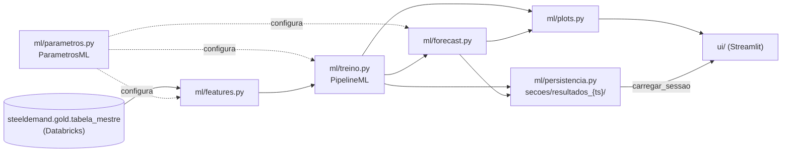
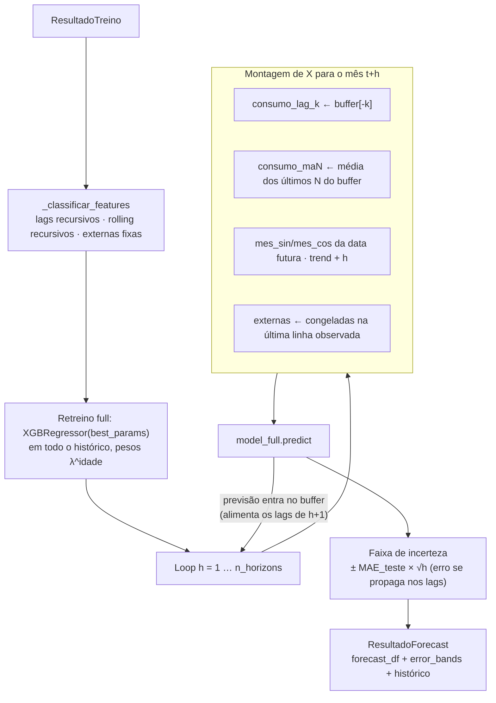
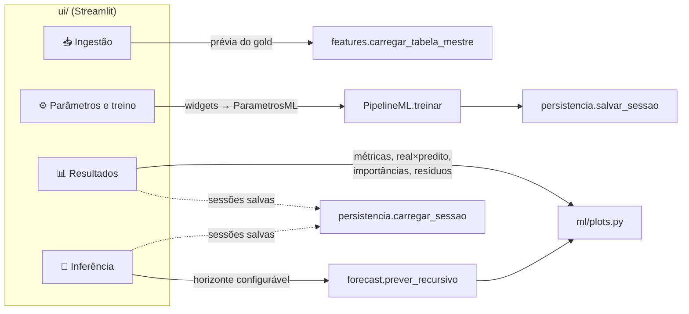

# Fluxo de Machine Learning — pacote `ml/`

O pacote `ml/` é a modularização do pipeline XGBoost + Optuna do `notebooks/pipeline_ml.ipynb` (SARIMA/SARIMAX permanecem só no notebook). É lógica pura, sem imports de Streamlit — a interface (`ui/`) apenas orquestra as chamadas. Este documento mostra como os módulos se encaixam e o caminho dos dados do gold até a previsão.

## Mapa de módulos

| Módulo | Responsabilidade | Principais símbolos |
|---|---|---|
| `ml/parametros.py` | Parâmetros globais com os defaults do notebook | `ParametrosML` |
| `ml/features.py` | Carga do gold, feature engineering e seleção de features | `carregar_tabela_mestre`, `criar_features`, `remover_multicolinearidade`, `filtrar_por_corr_target`, `selecao_por_permutacao` |
| `ml/treino.py` | Splits temporais, Optuna, walk-forward CV, modelo final e métricas | `PipelineML` (fachada), `SplitsTemporais`, `ResultadoTreino` |
| `ml/forecast.py` | Previsão recursiva multi-step com faixa de incerteza | `prever_recursivo`, `ResultadoForecast` |
| `ml/persistencia.py` | Salvar/listar/recarregar sessões de treino em disco | `salvar_sessao`, `carregar_sessao`, `listar_sessoes` |
| `ml/plots.py` | Gráficos Plotly consumidos pela UI | `plot_real_x_predito`, `plot_residuos`, `plot_forecast`, ... |

## Fluxo de treino — `PipelineML(params).treinar()`

```mermaid
flowchart TD
    subgraph dados["1 · Dados e features — ml/features.py"]
        gold[("steeldemand.gold.tabela_mestre")] --> carregar["carregar_tabela_mestre<br/>'data' datetime, ordenado"]
        carregar --> multicol["remover_multicolinearidade<br/>descarta features com |corr| mútua > 0.90"]
        multicol --> criar["criar_features<br/>lags do consumo (1,2,3) · lags macro (selic, ipca, pib)<br/>médias móveis 3/6/12 com shift(1) · mes_sin/mes_cos · trend<br/>dropna dos NaN gerados pelos lags"]
        criar --> corrtarget["filtrar_por_corr_target<br/>mantém |corr| com o target ≥ 0.05<br/>calculada só no trainval (sem vazar o teste)"]
    end

    subgraph splits["2 · Splits e pesos — ml/treino.py"]
        corrtarget --> dividir["dividir_splits<br/>train &lt; 2022-01 ≤ val &lt; 2025-01 ≤ test"]
        dividir --> pesos["calcular_pesos<br/>peso = λ^idade (λ = 0.95, recente pesa mais)"]
        pesos --> perm{"usar_permutation_importance?<br/>(default: não)"}
        perm -- sim --> permsel["selecao_por_permutacao<br/>mantém importance_mean > 0 no val<br/>força consumo_lag_1/2 e consumo_ma3"]
        permsel --> refaz["dividir_splits (refeito)"]
    end

    subgraph otim["3 · Otimização e modelo final — ml/treino.py"]
        perm -- não --> optuna
        refaz --> optuna["otimizar_hiperparametros<br/>Optuna, 50 trials, minimiza MSE no val<br/>early stopping no val (20 rounds)"]
        optuna --> wf["walk_forward_cv<br/>TimeSeriesSplit: 8 folds × 6 meses no trainval<br/>MAPE por fold (estabilidade)"]
        wf --> final["treinar_final<br/>XGBRegressor(best_params) no trainval completo"]
        final --> metricas["calcular_metricas<br/>R² · MSE · MAE · MAPE por split"]
    end

    metricas --> resultado["ResultadoTreino<br/>modelo + predições + métricas + features + splits"]
    resultado --> sessao["salvar_sessao — ml/persistencia.py"]
```

Proteções contra leakage embutidas no fluxo: as médias móveis usam `shift(1)` antes do `rolling` (nenhuma feature vê o valor corrente), a seleção por correlação usa apenas o trainval, e o conjunto de teste só é tocado em `calcular_metricas`.

## Fluxo de inferência — `prever_recursivo(resultado, n_horizons)`

A previsão é recursiva: o modelo é retreinado em **todo** o histórico (incluindo o teste) e cada previsão alimenta os lags/médias móveis do passo seguinte. Features externas (macro, ANFAVEA, CNO...) não têm futuro conhecido e ficam congeladas no último valor observado.

## Sessões — `ml/persistencia.py`

Cada treino gera um diretório recarregável `secoes/resultados_{timestamp}/`:

| Arquivo | Conteúdo |
|---|---|
| `modelo.json` | XGBoost em formato nativo (estável entre versões, não é pickle) |
| `params.json` | `ParametrosML` + `best_params` do Optuna + `feature_cols` + metadados |
| `metricas.json` | Métricas por split + MAPEs do walk-forward CV |
| `valid_data.xlsx` | X + y_real + y_pred + split |
| `forecast.xlsx` | Previsão futura (quando gerada na aba de inferência) |

`carregar_sessao` recarrega modelo e métricas do disco, mas **reconstrói as features a partir da tabela mestre atual** (`preparar_features_para_inferencia`, que reaplica o feature engineering e seleciona as `feature_cols` salvas, sem refazer a seleção estatística) — necessário porque a previsão recursiva precisa do histórico do target, não só do modelo.

## Quem chama o quê na interface

O estado entre abas vive em `st.session_state` (chaves em `ui/estado.py`); o `ResultadoTreino` do último treino e a sessão selecionada são compartilhados entre Resultados e Inferência.
